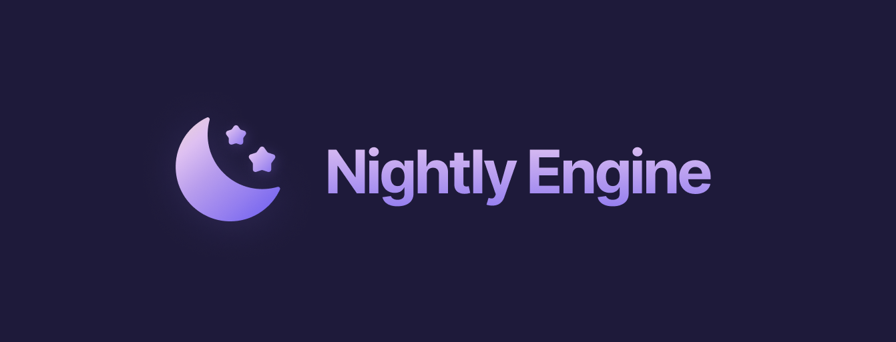

A modern, lightweight and cross-platform engine that makes game development fun again.

## Current state

The engine is currently in the pre-alpha stage and thus not fully functional. The latest version can be found in the `development`
branch and stable versions will have their own branches in the future. If you'd like to try out the engine, you can
follow the steps below to [build it from source](#building-from-source). If you'd like to contribute, you're welcome!
 
 Follow me on [Twitter](https://twitter.com/byfutureblur) to stay up to date.

## FAQ

### Oh God, another game engine?

Yes, because they're fun to make. And time-consuming. But seriously though, I feel like all the engines out there are
missing something. Some lack a polished and modern user interface, while others don't work well on all platforms or are
just too heavy for simple games.
 This engine tries to solve all of these problems while maintaining a good developer experience. Making quality games
is hard enough - especially for solo devs - so why make it even harder?

### I'm already comfortable with [insert name], why should I suddenly switch?

This engine is **not** in direct competition with Unreal, Unity, etc. and I'm not asking you to drop the engine you are
using. If you need something that is cross-platform, lightweight on your disk, and fun to work with, then you should
give Nightly a try. If you like it, you can continue using it, if not, you can freely switch back. The choice is yours.

### How much does it cost?

The entire engine is open source, and will be, forever. This means that you don't have to pay a single cent to use it.

### Can I make commercial games with Nightly?

Absolutely! Whether it's on Steam, Itch.io, App Store or elsewhere. You don't even have to pay for any fees.

### How can I get rid of the splash screen?

There is no splash screen.

### Where is the catch? How do you make money?

There is no catch. Nightly Engine is open source, meaning that I can't restrict the usage by requiring some sort of
payment. If you would like to support the development process in any way, you can do so by sponsoring this project on
GitHub or following me on [Twitter](https://twitter.com/byfutureblur). Also, feel free to ⭐️ this repo! Your help is
greatly appreciated.

## Building from source

Follow these steps to build Nightly from source:

- Clone the repo: `git clone https://github.com/Futureblur/NightlyEngine.git`
- Go to the engine directory: `cd NightlyEngine`
- Install all the submodules: `git submodule update --init`

After that, follow the specific instructions for your OS down below.

### Mac

1. Install [Xcode](https://apps.apple.com/en/app/xcode/id497799835?l=en)
   and [Homebrew](https://brew.sh/index).
4. Open your terminal and navigate to the `Scripts` folder: `cd Scripts`
2. Install all the dependencies `python3 ./InstallDeps.py`
5. Generate your Xcode project files using: `python3 ./GenerateXcode.py`
6. Launch the editor: `python3 ./LaunchEditor.py`

Your project files will be written to `Engine/Build/{Configuration}/Engine/Source`, while the binaries will be stored
in `Engine/Binaries`. 
If you get an error message telling you that the `CMAKE_C_COMPILER` or `CMAKE_CXX_COMPILER` could not be found,
run: `sudo xcode-select --reset`.

### Linux

1. Python 3 is required. If not already installed, do it now: `sudo apt install python`
2. Open your terminal and navigate to the `Scripts` folder: `cd Scripts`
3. Install all the dependencies: `python3 ./InstallLinuxDependencies.py`
4. Generate and build the project: `python3 ./GenerateNinja.py`
5. Launch the editor: `python3 ./LaunchEditor.py`

Your project files will be written to `Engine/Build/{Configuration}/Engine/Source`, while the binaries will be stored
in `Engine/Binaries`. You can now open the project using an IDE like CLion.

### Windows

1. Download and install
   CMake [here](https://github.com/Kitware/CMake/releases/download/v3.23.1/cmake-3.23.1-windows-x86_64.msi). In the
   installer, select the option to also add CMake into your PATH environment variable.
2. Download and install python3 [here](https://www.python.org/downloads/) and also add it to your PATH.
3. Download the latest release of ninja [here](https://github.com/ninja-build/ninja/releases/tag/v1.10.2). Unzip the
   folder into a directory you wish. Add the full path to `ninja.exe` to your PATH.
4. Download and install the latest version of [Visual Studio](https://visualstudio.microsoft.com/de/downloads/) and make
   sure you select the option **Desktop development with C++** in the installer. On the right hand side, check the box
   for **C++ Clang tools for Windows** to also install the clang compiler.
5. Open cmd.exe and navigate into the `Scripts` folder: `cd Scripts`
6. Generate and build the project: `python ./GenerateNinja.py`
7. Launch the editor: `python ./LaunchEditor.py`

Your project files will be written to `Engine/Build/{Configuration}/Engine/Source`, while the binaries will be stored
in `Engine/Binaries`. You can now open the project using an IDE like Visual Studio or CLion.

## License

Nightly Engine is distributed under the GPL-3.0 license.
See [LICENSE.md](https://github.com/Futureblur/NightlyEngine/blob/development/LICENSE.md) for more information.
